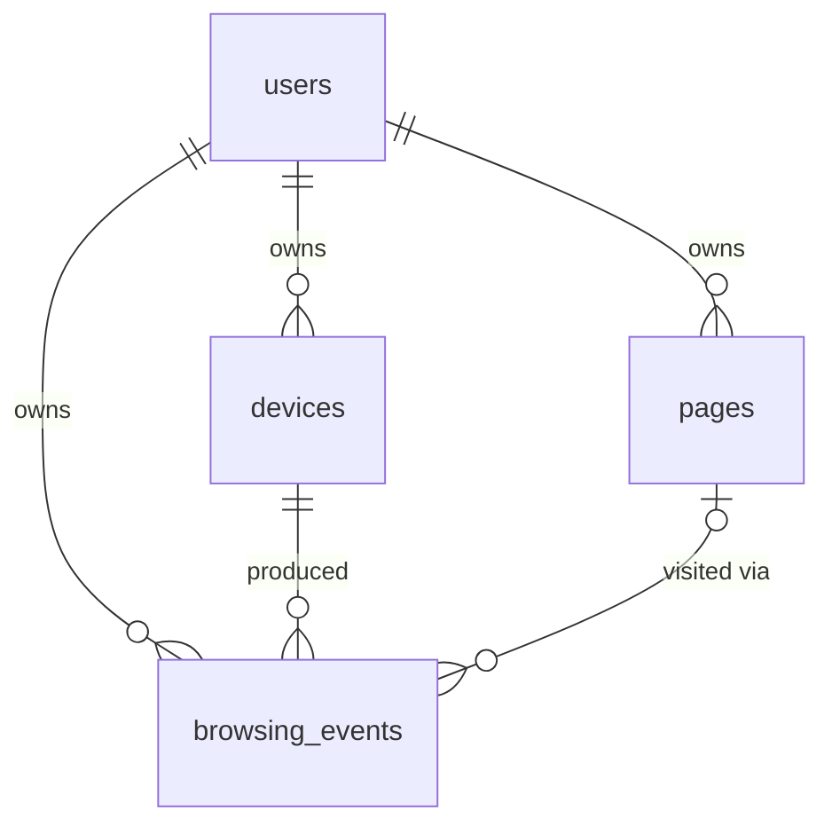

# Architecture

This document separates what **exists today** from what is **planned**. Nothing in the "Future"
sections is implemented.

## Intended evolution

```
Browser Extension → Privacy Filter → Backend → PostgreSQL + pgvector → Embedding Layer
   → Retrieval → Temporal/Session Ranking → ML Ranking → Analytics → Dashboard
```

| Component | Status |
|---|---|
| Browser Extension | **Future** (`extension/` is a placeholder) |
| Privacy Filter (in the extension, before upload) | **Future** |
| Backend (FastAPI) | **Current**: `GET /api/v1/health`, `POST /api/v1/capture` (unauthenticated, development stage) |
| Ingestion (validate → normalise URL → page upsert → event) | **Current** |
| PostgreSQL + pgvector | **Current**: schema + extension enabled; no vector data |
| Embedding Layer | **Future** |
| Retrieval (vector similarity search) | **Future** |
| Temporal/Session Ranking | **Future** |
| ML Ranking | **Future** |
| Analytics (drift, clustering, trajectories) | **Future** |
| Dashboard | **Future** |
| Authentication / device sync | **Future** |

---

# CURRENT IMPLEMENTATION (Days 1-2)

## Components

- **FastAPI app** (`backend/app`): built by `create_app(settings)`. The database engine is created in
  the app lifespan and stored on `app.state`; there is no module-level engine. The engine is lazy,
  so the API starts even if PostgreSQL is down and `/health` reports it.
- **Sync SQLAlchemy 2.x + psycopg 3.** A synchronous stack was chosen for simplicity (FastAPI runs
  `def` endpoints in a threadpool). It is a reasonable fit for a single-user-scale system; revisit
  if ingestion throughput demands async.
- **Alembic** owns the schema. `migrations/env.py` reads the URL from application settings.
- **Configuration**: `pydantic-settings`, environment variables only, no default credentials.

## Schema



| Table | Purpose | Key columns |
|---|---|---|
| `users` | Owner of all data | `id` (UUID), `created_at`, `updated_at` |
| `devices` | A browser/machine of a user | `id`, `user_id`, `label`, `created_at`, `last_seen_at` |
| `pages` | Canonical page, one per (user, URL) | `id`, `user_id`, `url`, `canonical_url`, `title`, `domain`, `extracted_text`, `first_seen_at`, `last_seen_at`, `created_at`, `updated_at` |
| `browsing_events` | Append-only log of observations | `id`, `user_id`, `device_id`, `page_id?`, `url`, `title`, `domain`, `occurred_at`, `session_id?`, `created_at` |

### Design decisions

**UUID primary keys, generated by the database** (`gen_random_uuid()`, PostgreSQL 13+). IDs can be
created by any device or service without coordination, which matters once several devices write.

**Ownership is enforced by the database, not just by application code.** `browsing_events` carries
`user_id` (so per-user queries need no join) and uses composite foreign keys
`(device_id, user_id) → devices(id, user_id)` and `(page_id, user_id) → pages(id, user_id)`. An
event therefore cannot reference another user's device or page, even if application code has a bug.
This costs two extra unique constraints on the parent tables.

**No duplicate pages.** `UNIQUE (user_id, canonical_url)` on `pages` is the de-duplication key.
Repeat visits, from any device, are new `browsing_events` rows pointing at the same page.
`canonical_url` is limited to 2048 characters so the btree entry stays within PostgreSQL's index size
limit; the ingestion layer enforces that bound on the *normalised* URL (see "Ingestion" below).

**`browsing_events.page_id` is nullable.** An observation may exist without a stored page (for
example, when a later privacy rule says not to keep page content).

**`domain` is the lowercased hostname.** Grouping by registrable domain (`docs.python.org` →
`python.org`) needs the public-suffix list and is left for later.

**`first_seen_at` / `last_seen_at` have no server default.** They derive from event times, which
can be older than upload time when a device syncs late, so the caller must be explicit.

**`session_id` is a plain nullable UUID with no foreign key.** Sessions/research threads are future
work; adding a `sessions` table later is an additive migration.

**Indexes** support the required access patterns: `browsing_events(user_id, occurred_at)` for user
activity and time ranges, `(device_id, occurred_at)` for one device, `(user_id, domain,
occurred_at)` for a domain, `(user_id, session_id)` for sessions, `(page_id)` for cascades and
joins; `pages(user_id, domain)`, `pages(user_id, last_seen_at)` and the unique key for pages.
Every index leads with the ownership or device column, so queries are always user-scoped.

**`updated_at`** is maintained by the ORM (`onupdate=now()`). Raw SQL updates would bypass it; a
database trigger can be added if raw writes become common.

## Ingestion (Day 2)

```
POST /api/v1/capture      (development stage: NOT authenticated)
   → validation           Pydantic schema (app/schemas/capture.py)
   → URL normalisation    app/core/urls.py         (pure functions)
   → device ownership     the (user_id, device_id) pair must exist
   → page upsert          INSERT … ON CONFLICT (user_id, canonical_url) DO UPDATE
   → event insert         always a new browsing_events row
   → COMMIT               app/services/ingestion.py owns the transaction
```

**Module boundaries.** `app/core/urls.py` is pure (no I/O, standard library only). `app/schemas/`
holds the HTTP contract, kept separate from the ORM models. `app/services/ingestion.py` is the only
place that writes pages and events. `app/api/` translates HTTP to and from the service and maps
failures to safe responses (`app/api/errors.py`). There is no repository layer: the service uses the
SQLAlchemy session directly.

### Why `pages` and `browsing_events` are separate

They answer different questions. A **page** is *what* the user has seen: one durable thing per
(user, canonical URL) that will later carry extracted text and embeddings. An **event** is *when,
where and how often*: an append-only observation with a device, a timestamp and a session. Merging
them would either duplicate page-level data (text, and later embeddings) on every visit, or throw
away the visit history that temporal ranking, session detection and drift analysis need.

### Why the canonical URL is the page identity

Retrieval must return one result for "that article", not one per campaign link. Identity is
`(user_id, canonical_url)`: per user, so users never share or leak pages, and independent of device,
so a laptop and a phone visiting the same article converge on the same page. `pages.url` keeps the
first observed (normalised) URL; the two columns can diverge later if a canonical URL is inferred
from page content, which is future work.

### Why repeated visits become events

A revisit is information (recency, frequency, which device, which session) but is not a new
document. So a repeat visit reuses the page and inserts an event. On each visit the page's metadata
is updated in the same statement: `first_seen_at` = the earliest event, `last_seen_at` = the latest
(correct even when a device syncs late and events arrive out of order), the title follows the most
recent visit that has one (a missing title never erases a known one), and `updated_at` is bumped.

### Normalisation policy (`app/core/urls.py`) and why it is conservative

A wrongly merged pair of pages loses information permanently; a missed merge only leaves a
duplicate that later work can reconcile. So the rules only merge URLs that are equivalent by the
URL standards, or that differ solely in well-known tracking noise:

| Rule | Decision |
|---|---|
| Scheme | `http`/`https` only (lowercased); anything else is rejected |
| Credentials in URL (`user:pass@`) | rejected, never stored |
| Host | lowercased, IDNA/punycode encoded, one trailing dot removed |
| Port | default (80/443) dropped; other ports kept |
| Fragment | removed (trade-off: hash-routed single-page apps collapse into one page) |
| Empty path | becomes `/` |
| **Trailing slash** | **preserved.** `/docs` and `/docs/` stay distinct: servers may treat them differently, so merging risks a wrong merge. Only the empty path is rewritten |
| Tracking parameters | `utm_source/medium/campaign/term/content/id`, `gclid`, `fbclid`, `dclid`, `gbraid`, `wbraid`, `msclkid`, `yclid`, `mc_cid`, `mc_eid`; removed everywhere they occur, case-insensitively |
| Other query parameters | **kept** with their order, duplicates, `+` and empty values (`?page=2`, `?id=123`, `?search=vector+database` are meaningful) |
| Percent-encoding | escapes of unreserved characters decoded (`%7E` → `~`), other hex upper-cased, non-ASCII/space/stray `%` escaped as UTF-8; reserved characters are never decoded (`%2F` ≠ `/`) |
| Not done | sorting query parameters, resolving `..` segments, changing path/query case, stripping `www.`, upgrading `http` to `https`, following redirects, reading `<link rel=canonical>` |

`extract_domain()` returns the hostname only. Organisational grouping (`docs.python.org` →
`python.org`) needs the public-suffix list and is deliberately not attempted; the function is a
single replaceable seam.

### How PostgreSQL prevents duplicate pages

The service never checks "does this page exist?" in Python. It issues one statement,
`INSERT … ON CONFLICT (user_id, canonical_url) DO UPDATE … RETURNING …`, and PostgreSQL's unique
index arbitrates. If several requests race to create the same page, one insert wins, the others
wait for it to commit and then update the same row, and every request gets the same `page_id`. There
are no application locks, and no read-then-write window. A test runs eight real concurrent
requests and asserts exactly one page and eight events.

`RETURNING (xmax = 0)` tells the caller whether the row was inserted or updated (`page_created`). It
is a widely used PostgreSQL idiom rather than a documented API, so it is confined to one place and
covered by tests.

### Transactions and failure handling

The device check, page upsert and event insert commit together or roll back together, so a failure
never leaves a page without its event. Failures map to safe responses (`app/api/errors.py`): unknown
or foreign device → 404 (one error for both, so ids cannot be probed), unexpected integrity failure
→ 409, database unreachable → 503, anything else → 500, all in one JSON envelope. The engine is
created with `hide_parameters=True`, so bound values such as URLs and titles never appear in
exception text or logs, and the service logs identifiers only, never URLs.

### Why authentication is intentionally deferred

Authentication needs decisions that do not belong in an ingestion primitive: how a device proves
its identity, how devices are registered and paired to a user, token lifetime and revocation.
Designing them before the extension exists would be guesswork. Until then the endpoint accepts
caller-supplied `user_id`/`device_id`, which means **anyone who can reach the port can write events
for any user**. It is a development-stage boundary, to be run only on a trusted machine or
network. Ownership *consistency* (a device really belongs to that user) is checked, but it is not
authentication.

### How ingestion will feed embeddings and retrieval (future)

Nothing here extracts text or computes embeddings. What ingestion provides is the stable input for
them: `pages` is the unit that will be embedded (one row per user and canonical URL, with
`extracted_text` reserved for the content), `page_created`/`last_seen_at` show which pages are new or
revisited, and `browsing_events` supplies the temporal signal (recency, frequency, device, session)
for ranking. Embeddings will hang off `pages`, as described under "Vector storage".

### Known limits

- No idempotency key: a client retrying after a timeout can create a duplicate event.
- Normalisation cannot know that two different URLs serve the same content (e.g. sorted vs.
  unsorted parameters, or a site that ignores a parameter).
- Nothing is fetched, so the title and URL are whatever the client reported.

## Vector storage (pgvector)

**Today: the extension is enabled, and no vector column exists.** This is deliberate.

A pgvector column has a fixed dimension in its type (`vector(N)`), and that dimension is decided by
the embedding model, which has not been chosen. Inventing a number now would be a placeholder that
pretends the ML system exists, and would have to be migrated away.

Planned approach (not implemented), designed so the model can be swapped without redesigning the
database:

- Embeddings go in a **separate table** (working name `page_embeddings`), not on `pages`. Keys:
  `page_id`, plus the model identifier, so several models can coexist and re-embedding is a backfill,
  not an `ALTER TABLE` on `pages`.
- The table also carries a denormalised `user_id` (with the same composite-FK trick), so a
  user-scoped search is `WHERE user_id = :u ORDER BY embedding <=> :query LIMIT k` without a join.
- The **dimension is configuration**, read when that migration is authored, and recorded next to
  each embedding's model identifier. Changing to a model with a different dimension means a new
  column or table plus an index for it. It does not change `pages`, `browsing_events` or any existing
  code path.
- Approximate indexes (HNSW/IVFFlat) combined with a per-user filter can return fewer than `k` rows;
  at personal-archive scale an exact scan restricted by the `user_id` index may be enough. Decide
  with measurements when retrieval is built.

## Privacy and deletion

See [privacy.md](privacy.md). Architecturally: every table is owned by a user with
`ON DELETE CASCADE`, so `DELETE FROM users WHERE id = …` removes all of a user's data;
removing a device removes its events; removing a page removes the events pointing at it. Future
embedding tables will follow the same rule.

## Multi-device model

```
devices ─┐
devices ─┼──►  one user  ──►  shared Apogee backend  ──►  PostgreSQL + pgvector
devices ─┘
```

Not "one browser → one local database → one machine". The schema already models many devices per
user. **How** a device authenticates and syncs is future work; there is no authentication today.

---

# FUTURE COMPONENTS (not implemented)

1. **Browser extension** captures permitted activity (URL, title, timestamp).
2. **Privacy filter** runs *in the extension, before upload*: exclusion lists, no private/Incognito
   windows by default, stripping sensitive URL parts.
3. **Authentication and device registration** for the capture API, plus event idempotency.
4. **Embedding layer**: page text → vectors, stored in pgvector (see above).
5. **Retrieval**: natural-language query → user-scoped vector similarity search.
6. **Temporal/session ranking**: recency, sessions, co-visitation.
7. **ML ranking**: a model trained on relevance-labelled data.
8. **Analytics**: topic evolution, semantic drift, clustering.
9. **Dashboard**: coverage and research-trajectory visualisation, privacy controls.
