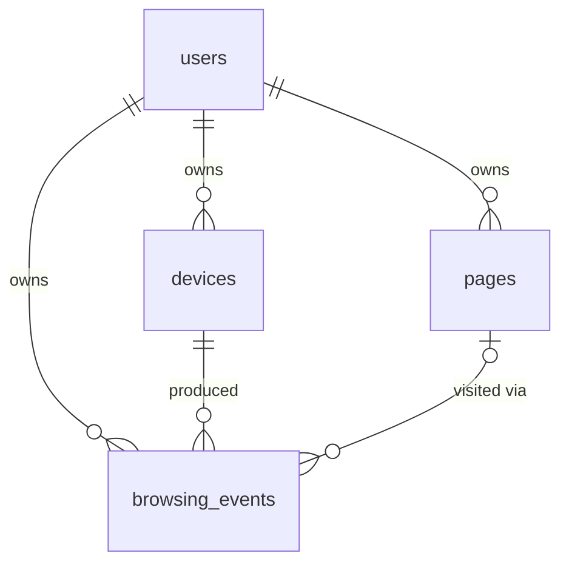

# Architecture

This document separates what **exists today** from what is **planned**. Nothing in the "Future"
sections is implemented.

## Intended evolution

```
Browser Extension → Privacy Filter → Backend → PostgreSQL + pgvector → Embedding Layer
   → Retrieval → Temporal/Session Ranking → ML Ranking → Analytics → Dashboard
```

| Component | Status |
|---|---|
| Browser Extension | **Future** (`extension/` is a placeholder) |
| Privacy Filter (in the extension, before upload) | **Future** |
| Backend (FastAPI) | **Current**: health endpoint only |
| PostgreSQL + pgvector | **Current**: schema + extension enabled; no vector data |
| Embedding Layer | **Future** |
| Retrieval (vector similarity search) | **Future** |
| Temporal/Session Ranking | **Future** |
| ML Ranking | **Future** |
| Analytics (drift, clustering, trajectories) | **Future** |
| Dashboard | **Future** |
| Authentication / device sync | **Future** |

---

# CURRENT IMPLEMENTATION (Day 1)

## Components

- **FastAPI app** (`backend/app`): built by `create_app(settings)`. The database engine is created in
  the app lifespan and stored on `app.state`; there is no module-level engine. The engine is lazy,
  so the API starts even if PostgreSQL is down and `/health` reports it.
- **Sync SQLAlchemy 2.x + psycopg 3.** A synchronous stack was chosen for simplicity (FastAPI runs
  `def` endpoints in a threadpool). It is a reasonable fit for a single-user-scale system; revisit
  if ingestion throughput demands async.
- **Alembic** owns the schema. `migrations/env.py` reads the URL from application settings.
- **Configuration**: `pydantic-settings`, environment variables only, no default credentials.

## Schema



| Table | Purpose | Key columns |
|---|---|---|
| `users` | Owner of all data | `id` (UUID), `created_at`, `updated_at` |
| `devices` | A browser/machine of a user | `id`, `user_id`, `label`, `created_at`, `last_seen_at` |
| `pages` | Canonical page, one per (user, URL) | `id`, `user_id`, `url`, `canonical_url`, `title`, `domain`, `extracted_text`, `first_seen_at`, `last_seen_at`, `created_at`, `updated_at` |
| `browsing_events` | Append-only log of observations | `id`, `user_id`, `device_id`, `page_id?`, `url`, `title`, `domain`, `occurred_at`, `session_id?`, `created_at` |

### Design decisions

**UUID primary keys, generated by the database** (`gen_random_uuid()`, PostgreSQL 13+). IDs can be
created by any device or service without coordination, which matters once several devices write.

**Ownership is enforced by the database, not just by application code.** `browsing_events` carries
`user_id` (so per-user queries need no join) and uses composite foreign keys
`(device_id, user_id) → devices(id, user_id)` and `(page_id, user_id) → pages(id, user_id)`. An
event therefore cannot reference another user's device or page, even if application code has a bug.
This costs two extra unique constraints on the parent tables.

**No duplicate pages.** `UNIQUE (user_id, canonical_url)` on `pages` is the de-duplication key.
Repeat visits, from any device, are new `browsing_events` rows pointing at the same page.
Trade-offs: (a) `canonical_url` is limited to 2048 characters so the btree entry stays within
PostgreSQL's index size limit, so ingestion must normalise/truncate over-long URLs; (b) *how* URLs
are normalised (tracking parameters, fragments, trailing slashes) is deliberately left to the
ingestion work, so today `canonical_url` is simply whatever the caller supplies.

**`browsing_events.page_id` is nullable.** An observation may exist without a stored page (for
example, when a later privacy rule says not to keep page content).

**`domain` is the lowercased hostname.** Grouping by registrable domain (`docs.python.org` →
`python.org`) needs the public-suffix list and is left for later.

**`first_seen_at` / `last_seen_at` have no server default.** They derive from event times, which
can be older than upload time when a device syncs late, so the caller must be explicit.

**`session_id` is a plain nullable UUID with no foreign key.** Sessions/research threads are future
work; adding a `sessions` table later is an additive migration.

**Indexes** support the required access patterns: `browsing_events(user_id, occurred_at)` for user
activity and time ranges, `(device_id, occurred_at)` for one device, `(user_id, domain,
occurred_at)` for a domain, `(user_id, session_id)` for sessions, `(page_id)` for cascades and
joins; `pages(user_id, domain)`, `pages(user_id, last_seen_at)` and the unique key for pages.
Every index leads with the ownership or device column, so queries are always user-scoped.

**`updated_at`** is maintained by the ORM (`onupdate=now()`). Raw SQL updates would bypass it; a
database trigger can be added if raw writes become common.

## Vector storage (pgvector)

**Today: the extension is enabled, and no vector column exists.** This is deliberate.

A pgvector column has a fixed dimension in its type (`vector(N)`), and that dimension is decided by
the embedding model, which has not been chosen. Inventing a number now would be a placeholder that
pretends the ML system exists, and would have to be migrated away.

Planned approach (not implemented), designed so the model can be swapped without redesigning the
database:

- Embeddings go in a **separate table** (working name `page_embeddings`), not on `pages`. Keys:
  `page_id`, plus the model identifier, so several models can coexist and re-embedding is a backfill,
  not an `ALTER TABLE` on `pages`.
- The table also carries a denormalised `user_id` (with the same composite-FK trick), so a
  user-scoped search is `WHERE user_id = :u ORDER BY embedding <=> :query LIMIT k` without a join.
- The **dimension is configuration**, read when that migration is authored, and recorded next to
  each embedding's model identifier. Changing to a model with a different dimension means a new
  column or table plus an index for it. It does not change `pages`, `browsing_events` or any existing
  code path.
- Approximate indexes (HNSW/IVFFlat) combined with a per-user filter can return fewer than `k` rows;
  at personal-archive scale an exact scan restricted by the `user_id` index may be enough. Decide
  with measurements when retrieval is built.

## Privacy and deletion

See [privacy.md](privacy.md). Architecturally: every table is owned by a user with
`ON DELETE CASCADE`, so `DELETE FROM users WHERE id = …` removes all of a user's data;
removing a device removes its events; removing a page removes the events pointing at it. Future
embedding tables will follow the same rule.

## Multi-device model

```
devices ─┐
devices ─┼──►  one user  ──►  shared Apogee backend  ──►  PostgreSQL + pgvector
devices ─┘
```

Not "one browser → one local database → one machine". The schema already models many devices per
user. **How** a device authenticates and syncs is future work; there is no authentication today.

---

# FUTURE COMPONENTS (not implemented)

1. **Browser extension** captures permitted activity (URL, title, timestamp).
2. **Privacy filter** runs *in the extension, before upload*: exclusion lists, no private/Incognito
   windows by default, stripping sensitive URL parts.
3. **Ingestion API** with authentication and device registration; URL normalisation; page upsert.
4. **Embedding layer**: page text → vectors, stored in pgvector (see above).
5. **Retrieval**: natural-language query → user-scoped vector similarity search.
6. **Temporal/session ranking**: recency, sessions, co-visitation.
7. **ML ranking**: a model trained on relevance-labelled data.
8. **Analytics**: topic evolution, semantic drift, clustering.
9. **Dashboard**: coverage and research-trajectory visualisation, privacy controls.
